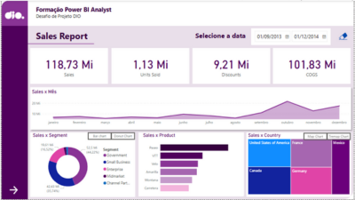
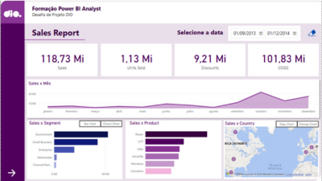

# 📊 Meu Projeto Power BI - Sample Financials  

Esse repositório faz parte do **Desafio da DIO no Bootcamp de Ciência de Dados do Santander** e é mais um passo na minha jornada de aprendizado. Aqui você encontrará um **dashboard interativo** baseado na `sample financials`, onde explorei métricas importantes e implementei **navegabilidade intuitiva**.  

O desafio propunha a criação de um relatório mais elaborado, incluindo a **segunda página do relatório**, que desenvolvi aplicando os conceitos aprendidos. Além disso, fiz **melhorias na primeira página**, aprimorando os elementos visuais e refinando a análise de dados para uma experiência mais completa! 🚀  

---

## 🎯 Objetivo  
O principal objetivo desse projeto foi criar uma **visualização eficiente e impactante**, utilizando:  
✅ **Estrutura bem definida** para uma melhor leitura  
✅ **Botões de navegação** para facilitar a experiência do usuário  
✅ **Segmentadores inteligentes** para seleção dinâmica de dados  
✅ **Gráficos personalizados** para uma análise mais rica  

---

## 🛠️ Tecnologias Utilizadas  
💡 **Power BI** - Modelagem e visualização de dados  
💾 **Banco de Dados** - `sample financials`  
🌐 **GitHub** - Organização e compartilhamento do projeto  

---

## 📌 Como utilizar?  
1. Baixe o arquivo `.pbix` e abra no **Power BI**  
2. Navegue pelo dashboard usando os **botões interativos**  
3. Filtre os dados conforme sua necessidade usando os **segmentadores**  
4. Confira os **gráficos dinâmicos** e tire suas próprias conclusões 📈  

💡 **Dica:** Você pode publicar o dashboard no **Power BI Service** para compartilhamento online!  

---

## 🖥️ Preview do Dashboard  

O relatório desenvolvido no Power BI é composto por **duas páginas principais**:  

- **Sales Report** → A primeira página apresenta um panorama das **vendas**, incluindo métricas essenciais e tendências de desempenho.  
- **Profit Report** → A segunda página detalha a **análise de lucro**, trazendo uma visão mais aprofundada dos resultados financeiros.  

Confira abaixo alguns **prints de tela** do relatório criado no Power BI:  

 
🔹 **Visão geral das vendas** e principais indicadores  

  
🔹 **Análise detalhada do lucro**, segmentada por diferentes fatores  

📺 **Demo do Dashboard**  
Veja um vídeo demonstrativo dos recursos utilizados:  
[](visuals/demo-video.mp4)  

---

## 📎 Links e Recursos  
🔗 Repositório original do desafio: [Sample Financials](https://github.com/julianazanelatto/power_bi_analyst)  
📺 Vídeos de passo a passo para a construção do relatório  
📂 **visuals/** → Contém **prints de tela** do relatório no Power BI e um **vídeo demonstrativo** dos recursos utilizados.  

---

## 🚀 Próximos Passos  
🔹 Explorar **novos gráficos** para enriquecer a análise 🎨  
🔹 Testar outras técnicas de **navegabilidade** no Power BI 🔄  
🔹 Compartilhar com a comunidade da **DIO e do Bootcamp Santander** 💼  

📢 **Feedbacks são sempre bem-vindos!** Se tiver sugestões para melhorias, sinta-se à vontade para contribuir.  

---

## 📂 Estrutura do Repositório

```bash
📂 dio-powerbi-financial-analysis/
 ├── 📄 README.md
 ├── 📂 data/  # Arquivo do banco de dados
 ├── 📂 report/  # Arquivo .pbix do Power BI
 ├── 📂 visuals/  # Prints de tela e vídeos do dashboard
```

---

## 📜 Licença  
Este projeto está licenciado sob a **MIT License** – sinta-se livre para usar, modificar e compartilhar!   
Para mais detalhes, consulte o texto completo da licença [aqui](https://opensource.org/licenses/MIT).

---

💜 Feito com dedicação por **Lidiane**  
